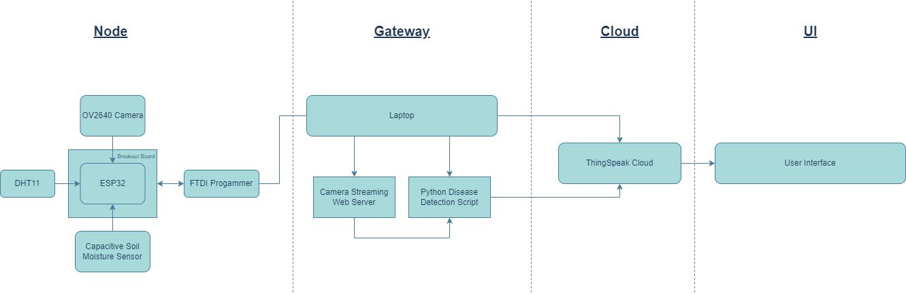

# Plant Happy 🌿
#### An end to end IoT solution for automated analysis of banana based on leaf disease detection and other weather and soil parameters. The solution is made for farmers allowing them to know which parameters of the banana plant are safe or in danger along with a guide page to help them care for the plant.
### Home Page

### Guide Page


## Software Tech Stack 
[](https://skillicons.dev)
* **HTML/Tailwind-CSS/JS:** For the User Interface of the application
* **Python:** Programming Language used for the backend.
* **Flask:** A micro web framework for developing the backend in the application.
* **Sckit-Learn:** Used for the development of the Random Forest Model for leaf disease detection.
* **ThingSpeak:** The cloud database used for analytics, pushing and recieving data from the hardware.

## Hardware Components:
* **Arduino IDE:** To program the microcontroller.
* **FTDI-Programmer:** Acts as an interface between USB and our microcontroller to help program it.
* **ESP32-Cam (OV2640):** Microcontroller with an OV2640 camera to capture images and retrieve analog signals from other sensors.
* **Breakout Board:** Allows the FTDI programmer to transmit voltage via the board to the ESP32 Microcontroller.
* **DHT11 Temperature & Humidity Sensor:** Allows us to get temperature in celcius and relative humidity.
* **Capacitive Soil Moisture Sensor:** Allows us to retrieve soil moisture levels with a relative interval of 0 - 1000.

## Architecture Diagram of the System


## Training and Saving the ML Model:
* Details regarding this can be found in the **Training_RF-Model** folder, it was trained and the dataset was loaded on Google Colab.
* The Model used was the Random Forest Model with the optimized specifications mentioned in the ipynb file, the model had an accuracy of 75%.

## Using your own keys and Setup:
Ensure you have python downloaded on your system to run this, if not download from here: [Download Python](https://www.python.org/downloads/)

* Update your Read, Write API keys and Channel ID in the **.env** file and also in the Arduino IDE code in the folder **ESP32_Program** for using your ThingSpeak Cloud Account.
* In Arduino IDE ensure you download the ThingSpeak library along with ESP32 libaries for usage (Click here and follow Laptop Arduino IDE setup for ESP32 libraries and getting Image URL as mentioned here in my previous project: [StepWise](https://github.com/AAbhijithA/StepWise/tree/main)) and run the code for streaming data and pushing it to cloud after the connections.

#### Install all the necessary libraries using the command:
```
pip install -r requirements.txt
```
#### Run the disease detection script by using:
```
python disease_det_script.py
```
#### Run the flask application by using:
```
python app.py
```
## Contributors
* Abhijith Ajith
* Nakshathra
* Viswaraje V


